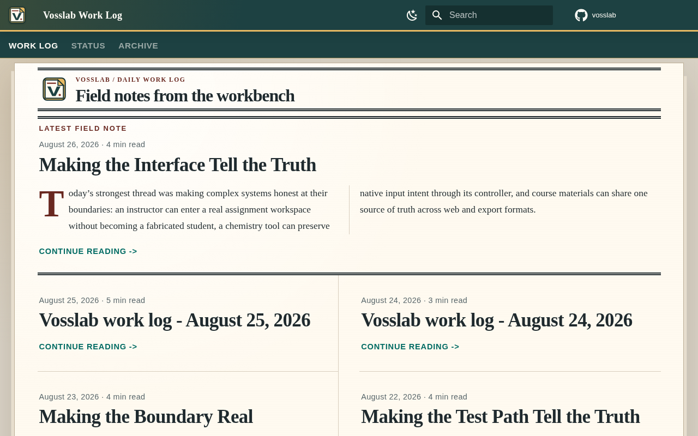
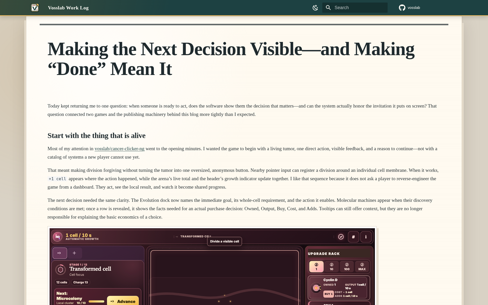

# Vosslab GitHub content pipeline

An evidence-grounded local publishing pipeline for makers who want GitHub activity turned into a
readable daily work-log post, supporting social and podcast drafts, and optional audio, with
published claims traceable to exact Git evidence.

## Turn a day of code into a build story

This is for a maker who wants readers to understand what changed, why it mattered, and what is
actually supported by the work--not just receive a changelog-shaped list of commits. The pipeline
collects verified repository activity, gives bounded editorial roles a shared evidence base, and
publishes only an eligible complete post.

- **Keep the evidence visible.** Exact Git activity becomes a bounded evidence packet and editorial
  projection, so the resulting story can name its support rather than inventing a retrospective.
- **Make a whole post, not a collage.** Independent editorial candidates and review preserve the
  strongest eligible complete artifact; partial output is never stitched into reader-facing prose.
- **Publish one coherent date.** `report_date` is the publication identity. A sealed bundle digest
  proves integrity, while an authorized rerun replaces that date's current publication.
- **Keep producer and publisher honest.** This repository owns evidence, editorial work, and sealed
  handoff. The sibling local publisher independently validates the same bytes before it builds and
  verifies the reader page.

The active production contract is `v4-three-examples-corpus-v2`, selected by an immutable maker
activation receipt. Candidate and referee deliberation stay in producer-owned run evidence; the
publisher receives only the validated selected post and its sealed provenance.

## The reader-facing result

The local Work Log presents a finished daily post as a readable field note, while provenance and
publication receipts remain available behind it. The controlled proof below verifies that journey
without relying on a model provider or network access.

<!-- screenshots:begin (managed by screenshot-docs) -->


<!-- screenshots:end -->

## Quick start: prove the public path safely

The supported runtime is Bash with Python 3.1x. From a prepared source checkout, load the
repository environment and run the disposable, no-egress publication proof:

```bash
source source_me.sh && python3 tests/e2e/e2e_daily_publication.py
```

Expected result: `Daily publication E2E passed.` The proof creates disposable producer and publisher
roots with deterministic evidence and editorial responses. It verifies initial publication,
same-date replacement, and preservation after an injected page-verification failure--without
credentials, a configured publisher checkout, live model access, or network access.

For installation details, including the repository-local virtual environment and development
dependencies, see [docs/INSTALL.md](docs/INSTALL.md).

## Publish a real report date

Real publication needs the configured GitHub credential source, editorial route, and local sibling
`vosslab-daily-blog` checkout. Once those are ready, use the repository-root command:

```bash
./make_blog.py --yesterday
./make_blog.py --date 2026-08-21
```

`--yesterday` is the noninteractive scheduled path and automatically replaces an occupied date.
An interactive explicit date instead asks `Overwrite YYYY-MM-DD? [N/y]:`; use `--yes` when an
explicit-date replacement must run unattended. The checked-in systemd user timer invokes the
`--yesterday` form at 04:00 America/Chicago.

## What completes a day

The daily route moves from verified activity to a reader-visible page without losing its audit trail:

```text
GitHub activity -> exact evidence -> independent editorial work -> eligible whole post
               -> sealed bundle -> publisher validation -> built and verified reader page
```

The producer sends `vosslab.daily-blog.bundle.v9`, binding the date, selected artifact, evidence,
roster, editorial projection, prompt and activation identities, source-safety policy, and digest.
Its canonical `publication_surface.json` carries the one survivor-scoped publication authority:
required repository coverage plus the exact evidence IDs and image paths available to the post.
The bundle asset list, transient renderer stage, installed assets, and rendered-page image check all
derive from that surface. The producer validates the sealed snapshot before handoff; the renderer
confines placement and lets MkDocs decide whether the supplied Markdown is renderable.

Each attempt keeps bounded working state while it can still help diagnose a failure. After verified
delivery, the producer retains only the date-owned machine log and terminal summary:

```text
output-pipeline/<owner>/daily_blog/<report_date>/
  runlog-<report_date>.jsonl     canonical machine events
  summary.jsonl                  canonical terminal outcome
```

The producer's `vosslab.daily-blog.import-receipt.v3` binds the sealed transfer to the installed
post, every selected date-owned image, and the expected rendered page. Images use short links such
as `2026-08-17/vosslab-repository-<content-hash>-capture.png`; deterministic code owns those names.

## Also useful: local content drafts

When a date-owned, evidence-sealed Work Log post is not needed, the general GitHub-to-content route
creates user-scoped drafts beneath `output-pipeline/<github_username>/`:

```bash
source source_me.sh && python3 automation/run_local_pipeline.py --last-day
```

See [docs/USAGE.md](docs/USAGE.md) for its options, inputs, and outputs.

## Documentation routes

- [docs/INSTALL.md](docs/INSTALL.md): create the required Python 3.1x environment and verify it.
- [docs/USAGE.md](docs/USAGE.md): daily-publication commands, replacement behavior, and outputs.
- [docs/DAILY_BLOG_OPERATIONS.md](docs/DAILY_BLOG_OPERATIONS.md): operating, schedule, recovery,
  and investigation boundaries.
- [docs/CODE_ARCHITECTURE.md](docs/CODE_ARCHITECTURE.md): component ownership and trust boundaries.
- [docs/FILE_STRUCTURE.md](docs/FILE_STRUCTURE.md): commands, modules, prompts, tests, and output
  locations.
- [docs/FILE_FORMATS.md](docs/FILE_FORMATS.md): durable records and producer-to-publisher schemas.
- [docs/FAQ.md](docs/FAQ.md): concise operational answers.
- [docs/TROUBLESHOOTING.md](docs/TROUBLESHOOTING.md): setup, route, evidence, and publication
  diagnosis.

## Status and boundary

This is a private local producer-and-publisher workflow. The controlled E2E is the unattended
acceptance path; a live Hermes publication is optional corroboration, not a test prerequisite or
evidence of editorial quality. Prompt resources and the protected human editorial contract remain
outside this landing page and are validated by immutable identity at the production boundary.
