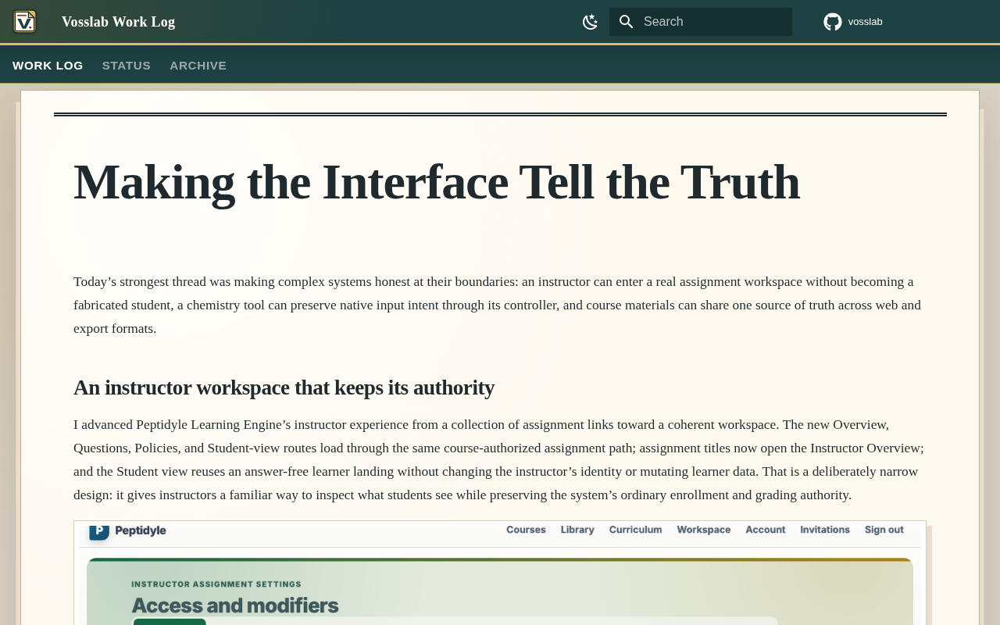

# Vosslab GitHub content pipeline

An evidence-grounded local publishing pipeline that turns a maker's GitHub work into a readable
daily blog post, social copy, podcast script, and optional audio, with each published claim tied to
exact Git evidence.

It treats a daily post as a small build story rather than a changelog dump. The general content
route creates drafts from GitHub activity; the nine-stage daily-publication route preserves
grounded editorial work across partial failures, promotes an eligible complete post, and proves the
reader-visible result through a sealed producer-to-publisher handoff.

## What makes a daily post trustworthy

The active production contract is `v4-three-examples-corpus-v2`, authorized by one immutable maker
activation receipt. The receipt binds the selected editorial contract, prompt identity, and
validation policy; production validates it rather than reopening a retired experiment or asking an
operator to approve a run.

The daily route carries one `report_date` from verified repository intake through publication. It
collects exact Git activity, assembles an evidence packet, makes a bounded editorial projection,
runs independent editorial candidates and review, preserves the strongest eligible whole post, then
validates, seals, imports, and verifies the reader page. An ordinary failed candidate or malformed
review is editorial degradation: eligible peers continue. Invalid provenance, unsafe storage, or no
eligible whole post is a typed pipeline fault; the system never assembles fallback prose from
fragments.

The publisher receives bundle `vosslab.daily-blog.bundle.v7`, not the candidate or referee
deliberation. It independently checks the selected post, its `best_artifact_id`, evidence,
projection, roster, activation, prompt identity, declared assets, and manifest digest before making
the date visible. Candidate and referee history remains producer-owned run evidence.

## Reader-facing result

The local Work Log turns the sealed post into a reader-facing build story. These existing captures
show the landing page and one published post; provenance and publication receipts remain available
behind that readable surface.




## A controlled proof of the public path

The permanent controlled E2E uses disposable local producer and publisher roots, synthetic Git
evidence, and a fail-closed local editorial responder. It exercises the root command, selected-post
handoff, rendered-page verification, a same-date replacement, and a typed post-import fault without
network or model access.

```bash
source source_me.sh && python3 tests/e2e/e2e_daily_publication.py
```

Expected result: `Daily publication E2E passed.` The test is evidence that the publication contract
works; it does not claim that fixture prose is a live editorial-quality result.

## Publish a real report date

With the local publisher, GitHub roster, and configured editorial routes ready, use the repository
root command:

```bash
./make_blog.py --yesterday
./make_blog.py --date 2026-08-21
```

The command owns the physical repository Python 3.12 runtime. `--yesterday` selects the preceding
calendar day in the configured report timezone. The scheduled 04:00 America/Chicago invocation is
noninteractive and automatically replaces the current publication for that same `report_date`; the
date remains the identity, while a bundle digest is integrity evidence. An interactive terminal
retains its explicit `Overwrite YYYY-MM-DD? [N/y]:` confirmation before replacing an occupied date.

The general GitHub-to-content route remains useful when a publishable, evidence-sealed work-log post
is not needed:

```bash
source source_me.sh && python3 automation/run_local_pipeline.py --last-day
```

It writes user-scoped drafts beneath `out/<github_username>/`. See
[docs/USAGE.md](docs/USAGE.md) for its options and outputs.

## What a completed day leaves behind

Each attempt has bounded run-state and event summaries, while the date-owned publication retains the
selected post and sealed bundle. The publisher's receipt and page-verification receipt bind the same
`report_date`, bundle digest, and selected artifact. This makes the important question inspectable:
which evidence supports this published story, and which complete artifact reached readers?

```text
out/<owner>/daily_blog/<report_date>/
  runs/<run_id>/                 bounded state, events, and editorial reliability summaries
  publication/bundle.json        sealed bundle-v7 manifest
  publication/evidence.json      exact source evidence
  publication/editorial_projection.json
  post.md                        selected reader-facing post
```

## Documentation routes

- [docs/INSTALL.md](docs/INSTALL.md): local prerequisites and setup.
- [docs/USAGE.md](docs/USAGE.md): general content and daily-publication commands.
- [docs/CODE_ARCHITECTURE.md](docs/CODE_ARCHITECTURE.md): ownership and trust boundaries.
- [docs/FILE_STRUCTURE.md](docs/FILE_STRUCTURE.md): commands, modules, prompts, tests, and output
  locations.
- [docs/OUT_DIRECTORY_ORGANIZATION_SPEC.md](docs/OUT_DIRECTORY_ORGANIZATION_SPEC.md): durable
  output and retention layout.
- [docs/FAQ.md](docs/FAQ.md): concise operational answers.
- [docs/TROUBLESHOOTING.md](docs/TROUBLESHOOTING.md): supported setup, route, evidence, and
  publication diagnosis.

## Current boundary

This is a private local producer and publisher workflow. Live daily publication can use configured
editorial routes and a local sibling MkDocs site; the controlled E2E is the unattended, no-egress
verification path. Prompt resources and the protected human editorial contract are intentionally
not restated here; their immutable identities are validated at the production boundary.
